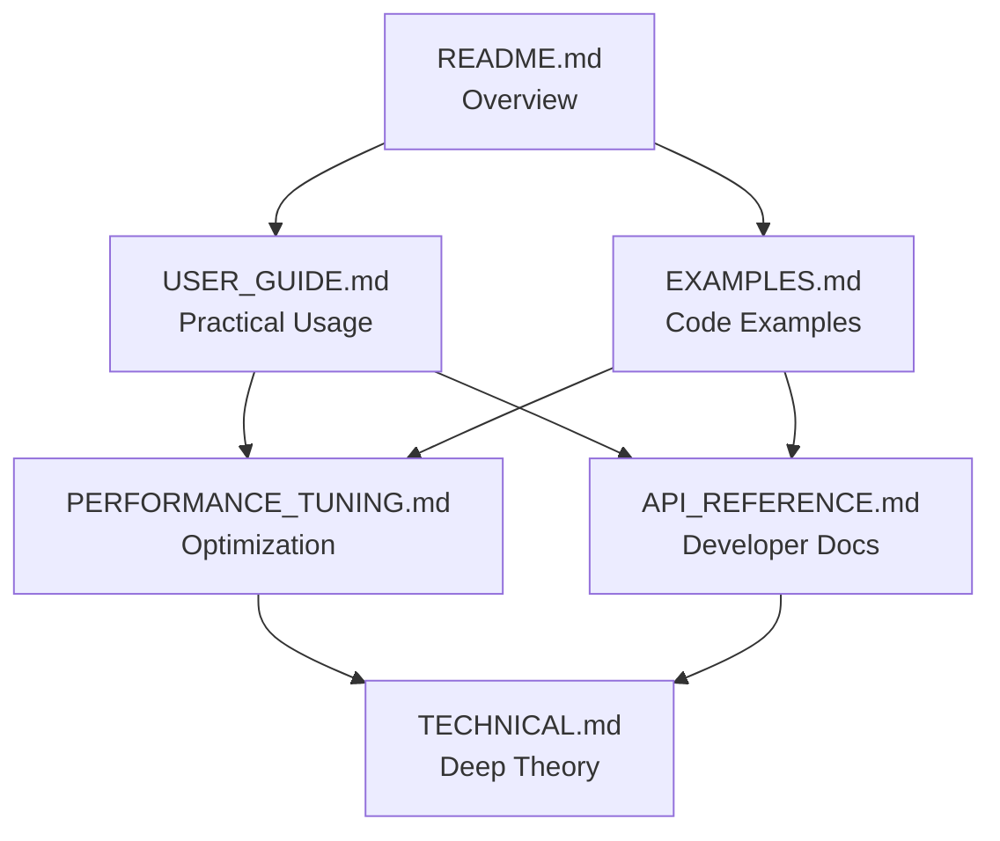

# Documentation Index: EKF for Velocity and Position Estimation

Welcome to the comprehensive documentation for the Extended Kalman Filter (EKF) module designed for estimating velocity and position from smartphone acceleration data during biomechanical exercises.

## 📚 Documentation Structure

### 🎯 [README.md](README.md) - **Start Here**
**Main overview and quick start guide**
- Module overview and purpose
- Key components and architecture
- Basic usage instructions
- Output files description
- Quick configuration guide

**Best for**: First-time users, getting an overview of capabilities

---

### 👤 [USER_GUIDE.md](USER_GUIDE.md) - **Practical Usage**
**Step-by-step user manual**
- Detailed workflow instructions
- Configuration parameter explanations
- Result interpretation guide
- Troubleshooting common issues
- Best practices and tips

**Best for**: Regular users, practical implementation, day-to-day usage

---

### 🔬 [TECHNICAL.md](TECHNICAL.md) - **Deep Dive**
**Mathematical foundation and implementation details**
- State space model mathematics
- Algorithm implementation details
- Performance monitoring theory
- Statistical validation methods
- Advanced technical concepts

**Best for**: Developers, researchers, understanding the theory behind the implementation

---

### 📖 [API_REFERENCE.md](API_REFERENCE.md) - **Developer Reference**
**Complete API documentation**
- Class and method documentation
- Function signatures and parameters
- Data structures and return values
- Usage examples for each component
- Integration guidelines

**Best for**: Developers integrating the module, extending functionality

---

### 🎛️ [PERFORMANCE_TUNING.md](PERFORMANCE_TUNING.md) - **Optimization Guide**
**Systematic parameter optimization**
- Performance metrics explanation
- Tuning methodology and strategies
- Parameter guidelines and ranges
- Troubleshooting specific issues
- Advanced optimization techniques

**Best for**: Users needing optimal performance, resolving convergence issues

---

### 💡 [EXAMPLES.md](EXAMPLES.md) - **Practical Examples**
**Code examples and configurations**
- Ready-to-use configuration files
- Python script examples
- Batch processing workflows
- Custom monitoring implementations
- Comparative analysis examples

**Best for**: Learning by example, template code, specific use cases

---

## 🎯 Quick Navigation

### I'm a new user, where do I start?
1. **[README.md](README.md)** - Understand what the module does
2. **[USER_GUIDE.md](USER_GUIDE.md)** - Learn how to use it
3. **[EXAMPLES.md](EXAMPLES.md)** - Try the examples

### I need to optimize performance
1. **[PERFORMANCE_TUNING.md](PERFORMANCE_TUNING.md)** - Systematic optimization
2. **[USER_GUIDE.md](USER_GUIDE.md)** - Configuration parameters
3. **[EXAMPLES.md](EXAMPLES.md)** - Different configuration examples

### I'm a developer/researcher
1. **[TECHNICAL.md](TECHNICAL.md)** - Mathematical foundation
2. **[API_REFERENCE.md](API_REFERENCE.md)** - Developer interface
3. **[EXAMPLES.md](EXAMPLES.md)** - Implementation examples

### I have a specific problem
1. **[USER_GUIDE.md](USER_GUIDE.md)** - Troubleshooting section
2. **[PERFORMANCE_TUNING.md](PERFORMANCE_TUNING.md)** - Specific issue fixes
3. **[TECHNICAL.md](TECHNICAL.md)** - Understanding the root cause

---

## 🔍 Key Concepts Index

### Core Functionality
- **Extended Kalman Filter**: [TECHNICAL.md](TECHNICAL.md#mathematical-foundation)
- **Performance Monitoring**: [TECHNICAL.md](TECHNICAL.md#performance-monitoring-system)
- **ZUPT (Zero-Velocity Updates)**: [TECHNICAL.md](TECHNICAL.md#zero-velocity-update-zupt)
- **Drift Correction**: [TECHNICAL.md](TECHNICAL.md#data-processing-pipeline)

### Configuration
- **Parameter Overview**: [USER_GUIDE.md](USER_GUIDE.md#configuration-guide)
- **Q Matrix Tuning**: [PERFORMANCE_TUNING.md](PERFORMANCE_TUNING.md#phase-2-q-matrix-tuning-process-noise)
- **R Parameter Tuning**: [PERFORMANCE_TUNING.md](PERFORMANCE_TUNING.md#phase-3-r-parameter-tuning-measurement-noise)
- **Configuration Examples**: [EXAMPLES.md](EXAMPLES.md#configuration-examples)

### Performance Analysis
- **Metrics Explanation**: [PERFORMANCE_TUNING.md](PERFORMANCE_TUNING.md#understanding-performance-metrics)
- **Statistical Tests**: [TECHNICAL.md](TECHNICAL.md#statistical-tests)
- **Report Interpretation**: [USER_GUIDE.md](USER_GUIDE.md#interpreting-results)
- **Quality Indicators**: [USER_GUIDE.md](USER_GUIDE.md#quality-indicators)

### Implementation
- **API Usage**: [API_REFERENCE.md](API_REFERENCE.md#usage-examples)
- **Class Documentation**: [API_REFERENCE.md](API_REFERENCE.md#core-classes)
- **Custom Extensions**: [EXAMPLES.md](EXAMPLES.md#advanced-examples)
- **Batch Processing**: [EXAMPLES.md](EXAMPLES.md#example-3-batch-processing)

---

## 🚀 Getting Started Checklist

### Prerequisites
- [ ] Python 3.8+ installed
- [ ] Required packages: `pip install -r requirements.txt`
- [ ] Acceleration data in text format
- [ ] Basic understanding of Kalman filters (optional but helpful)

### First Run
- [ ] Read [README.md](README.md) for overview
- [ ] Follow [USER_GUIDE.md](USER_GUIDE.md) setup instructions
- [ ] Try basic example from [EXAMPLES.md](EXAMPLES.md)
- [ ] Review performance report

### Optimization
- [ ] Understand metrics from [PERFORMANCE_TUNING.md](PERFORMANCE_TUNING.md)
- [ ] Apply tuning recommendations
- [ ] Iterate and validate results
- [ ] Document successful configurations

---

## 🎯 Use Case Scenarios

### Scenario 1: Research Application
**Goal**: Accurate velocity/position estimation for biomechanical analysis
**Documents**: [TECHNICAL.md](TECHNICAL.md), [PERFORMANCE_TUNING.md](PERFORMANCE_TUNING.md), [API_REFERENCE.md](API_REFERENCE.md)
**Focus**: Mathematical understanding, optimal parameter tuning, statistical validation

### Scenario 2: Application Development
**Goal**: Integrate EKF into mobile/desktop application
**Documents**: [API_REFERENCE.md](API_REFERENCE.md), [EXAMPLES.md](EXAMPLES.md), [USER_GUIDE.md](USER_GUIDE.md)
**Focus**: API usage, error handling, real-time performance

### Scenario 3: Data Analysis
**Goal**: Process collected smartphone data for exercise analysis
**Documents**: [USER_GUIDE.md](USER_GUIDE.md), [EXAMPLES.md](EXAMPLES.md), [PERFORMANCE_TUNING.md](PERFORMANCE_TUNING.md)
**Focus**: Batch processing, configuration management, result interpretation

### Scenario 4: Educational Use
**Goal**: Learn about Kalman filtering and signal processing
**Documents**: [README.md](README.md), [TECHNICAL.md](TECHNICAL.md), [EXAMPLES.md](EXAMPLES.md)
**Focus**: Understanding concepts, hands-on examples, visualization

---

## 📊 Document Complexity Levels

| Document | Complexity | Prerequisites | Time to Read |
|----------|------------|---------------|--------------|
| [README.md](README.md) | ⭐ Beginner | None | 10 minutes |
| [USER_GUIDE.md](USER_GUIDE.md) | ⭐⭐ Intermediate | Basic Python | 30 minutes |
| [EXAMPLES.md](EXAMPLES.md) | ⭐⭐ Intermediate | Python, basic config | 20 minutes |
| [PERFORMANCE_TUNING.md](PERFORMANCE_TUNING.md) | ⭐⭐⭐ Advanced | Signal processing basics | 45 minutes |
| [API_REFERENCE.md](API_REFERENCE.md) | ⭐⭐⭐ Advanced | Programming experience | 30 minutes |
| [TECHNICAL.md](TECHNICAL.md) | ⭐⭐⭐⭐ Expert | Kalman filter theory | 60 minutes |

---

## 🔄 Document Relationships

---

## 🛠️ Maintenance and Updates

This documentation is designed to be:
- **Modular**: Each document serves a specific purpose
- **Cross-referenced**: Documents link to related sections
- **Practical**: Emphasis on actionable information
- **Progressive**: From basic to advanced concepts

### Contributing to Documentation
- Keep examples up-to-date with code changes
- Add new troubleshooting scenarios as they arise
- Maintain consistency in terminology and notation
- Update performance benchmarks with new findings

---

## 📞 Support and Community

### Quick Help
- **Configuration Issues**: [USER_GUIDE.md](USER_GUIDE.md#troubleshooting)
- **Performance Problems**: [PERFORMANCE_TUNING.md](PERFORMANCE_TUNING.md#troubleshooting-specific-issues)
- **API Questions**: [API_REFERENCE.md](API_REFERENCE.md)
- **Theory Questions**: [TECHNICAL.md](TECHNICAL.md)

### Extended Support
- Review the complete documentation set
- Check examples for similar use cases
- Examine performance reports for guidance
- Consider the mathematical foundations for deeper understanding

This documentation ecosystem provides comprehensive coverage of the EKF module, from basic usage to advanced optimization and theoretical understanding. Start with the document that best matches your current needs and level of expertise.
